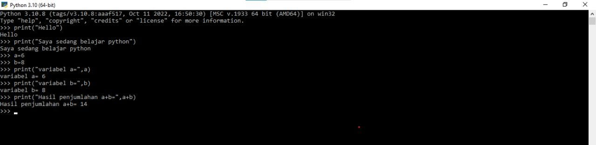
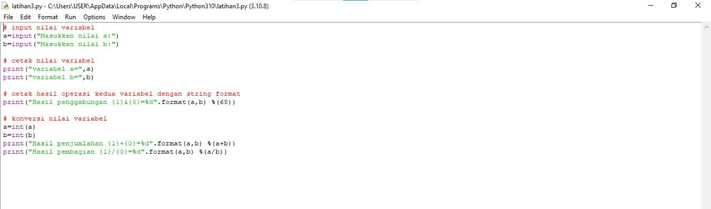
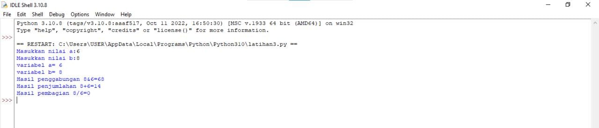
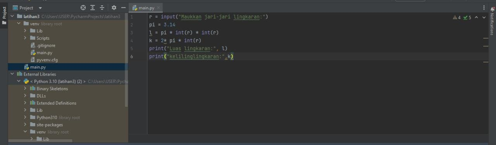

# lab2py
## latihan 3

### langkah-langkah menjalankan python , IDLE, dan pycharm
### langkah 1
### menjalankan python console
###  menampilkan tulisan "hello" di layar dan menampilkan tulisan "saya sedang belajar python" harus menggunakan perintah "print"
contoh :
print("hello")
print(" sata sedang belajar python")
### menjumlahkan dua buah bilangan menggunakan variabel a dan b 
mendefisinikan variabel a dengan nilai 8
mendefinisikan variabel a dengan nilai 6
mencetak hasil variabel a dan b 
mencetak hasil penjumlahan a+b
### hasil praktikum
 
### menjalankan IDLE
### langkah 2
membuat file baru dengan nama latihan3.py (pastikan lokasi file pada folder lab2py pada direktori kerja anda)
menggunakan fungsi input untuk mnengambil nilai variabel dari keyboard
dan di running
### hasil praktikum

### menjalankan PyCarm
### langkah 3 
create new project
latihan3
dan nama file main.py
### hasil praktikum
